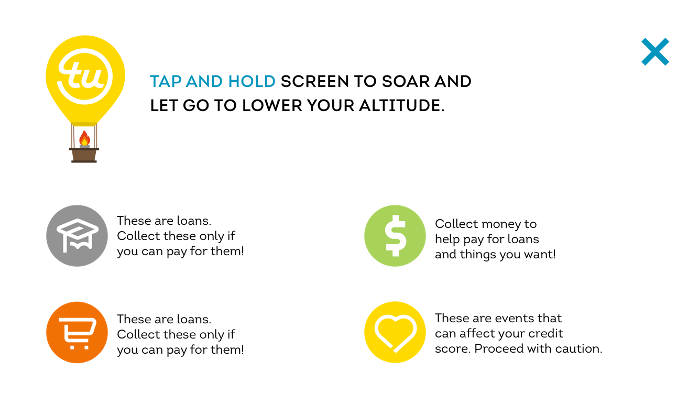
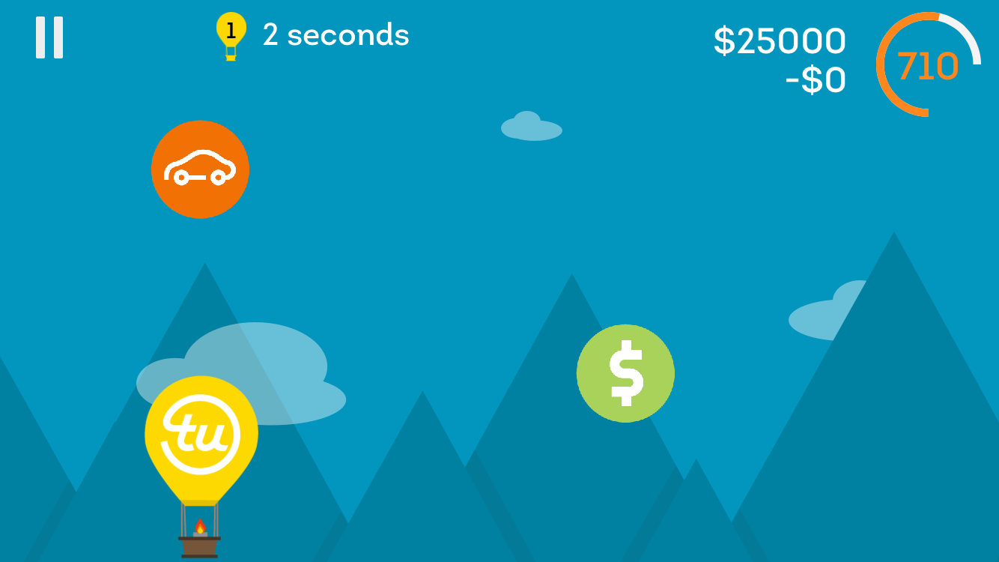
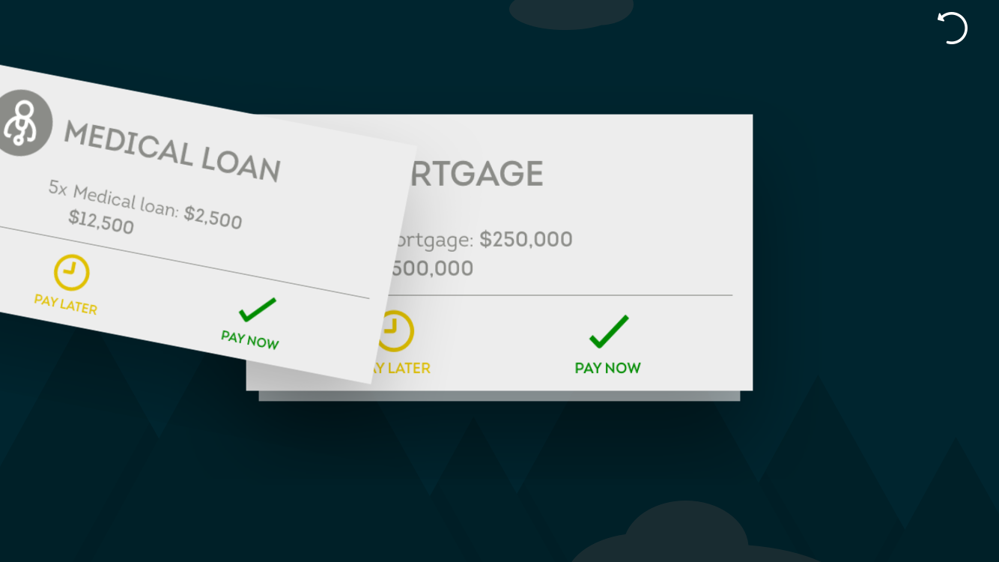
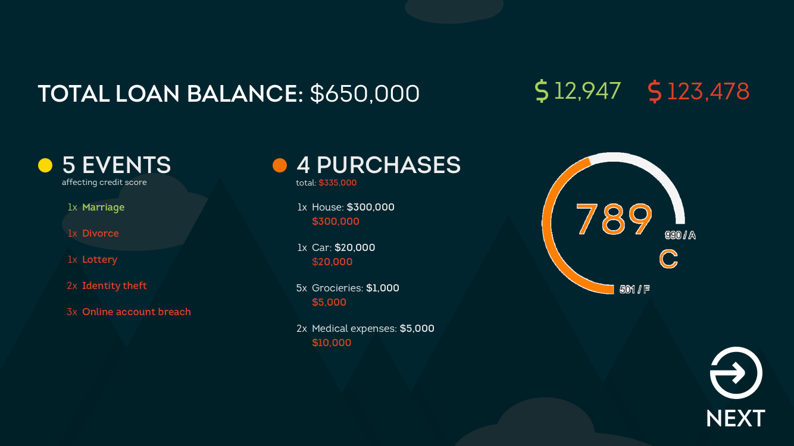
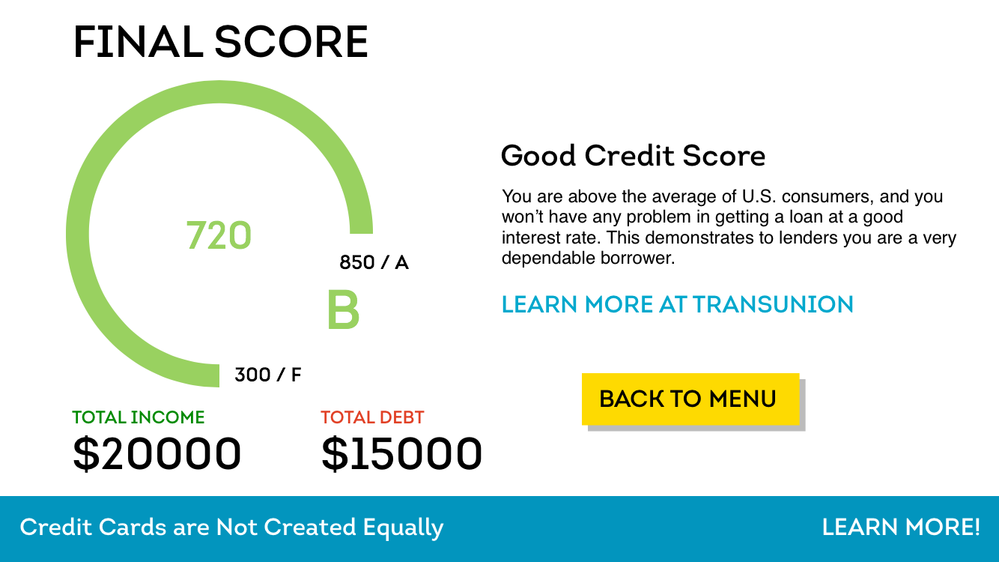
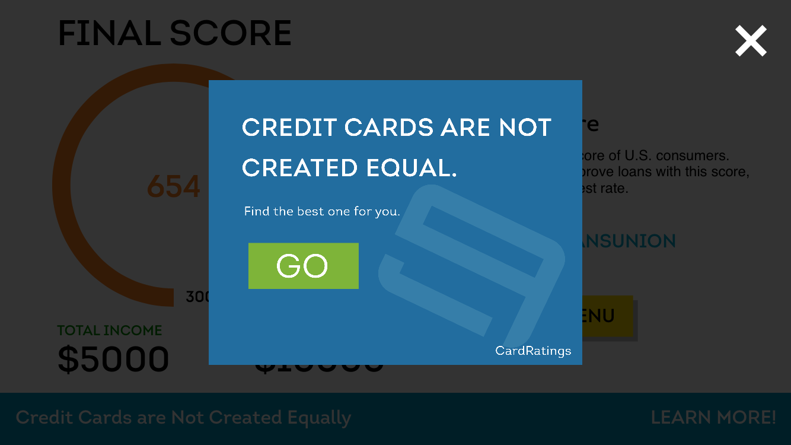

## TransUnion Hackathon 2016
### Team Red Pandas

* Russ Fenenga - Developer
* Vanessa Forney - Developer
* Michael Wong - Developer
* Kelby Hertanu - Designer
* Antonio Flamenco - Designer
* Tricia Santamaria - Marketer

### Game Screenshots

Soar & Score, an iOS game to help educate millenials about credit scores.

Tap the "How do I play?" button to learn more about the game.

Collect the various items, and avoid others, and your earnings and debt accumulate as the clock ticks. Your credit score is updated in real-time from the TransUnion Simulator API.

After the game, see the items you collected and decide which loans you are going to accept or reject.

Your results are summarized with how each event and purchase affected you.

Let's not forget a recap, which summarizes what your credit score means.

Finally, users can learn more which can bring in sponsor ads.

